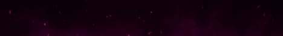

<h1 align="center"> Advanced Discord Music Bot </h1>

Thanks for 4k Views! I made this for you all!

## 📝 Latest Announcement
Discord-MusicBot v4 will be launched shortly :tada: You can able to check out the [project](https://github.com/SudhanPlayz/Discord-MusicBot/projects/1) and its [discussion](https://github.com/SudhanPlayz/Discord-MusicBot/discussions/72)

## 📝 Tutorial
Tutorial has been uploaded on YouTube  Watch it by clicking [here](https://youtu.be/DQXuTaYa31I)

## 📝 [Support Server](https://discord.gg/a9SHDpD)
Got any error or any problem with the code? Join this server and ask your question instead of creating issues unless its a code bug. https://discord.gg/a9SHDpD

## 📸 Screenshots

## 💨 Run the projects
Glitch: 
Repl: 
Heroku: 
## ✨ Contributors
Contributions are always welcomed :D

Made with :heart: and JavaScript!
