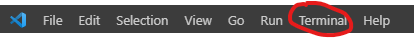

# Installation on a Windows computer/server

## Prerequisites

- [Discord Application](#create-a-discord-application)
- [Lavalink server](#lavalink)
- [NodeJS & NPM](#install-nodejs-npm)
- [Git](https://phoenixnap.com/kb/how-to-install-git-windows)

### Create a Discord Application

- go to the [Discord Developer portal](https://discord.com/developers/applications)
- create a new application + bot
- create a bot invitelink using it's client id [here](https://discordapi.com/permissions.html)
- save the bot token for later

### Install nodejs & npm

follow [these](https://github.com/nodesource/distributions) instructions

## Installation

- [Configuration](#configuration)
- [Lavalink](#lavalink)
- [Final Steps](#final-steps)

## Configuration

- Git clone the repository by opening command prompt or powershell and doing `git clone -b v5 https://github.com/SudhanPlayz/Discord-MusicBot`
- Open your IDE (recommended is VSCode) and open the repository, the folder name is `Discord-MusicBot`
- Configure the config.js there!

### lavalink

use [public lavalink](https://lavalink-list.darrennathanael.com)

or [host your own](https://darrennathanael.com/post/how-to-lavalink/)

## Final steps

- Deploy your slash commands by doing `npm run deploy` to deploy globally or `npm run guild` if you want to deploy on a specific guild.
- Open your terminal in vscode

- Once done, type `npm run start` or `node index.js`

Now your bot is running!